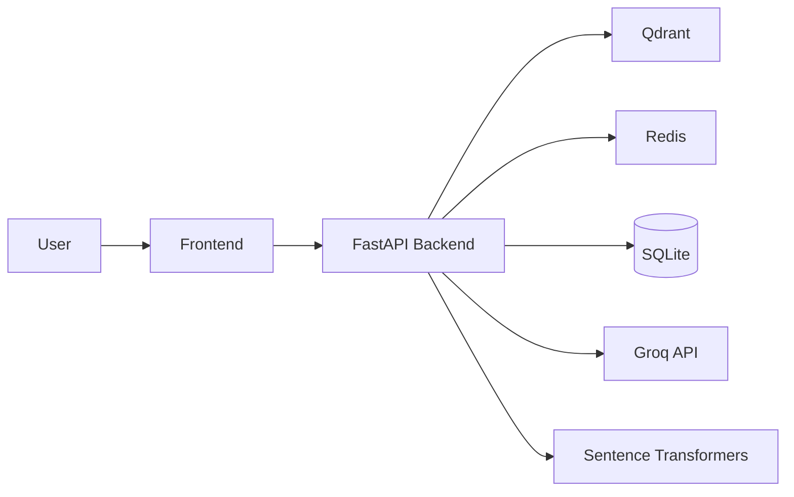

# Backend RAG with Two REST APIs

FastAPI backend for document ingestion and conversational RAG, paired with a small frontend shell and Docker Compose for running the full stack together.

## Architecture



The backend exposes two main REST APIs:

1. Document ingestion for PDF/TXT uploads, chunking, embeddings, and Qdrant storage.
2. Conversational RAG for multi-turn Q&A, Redis-backed history, and interview booking.

## Project Structure

```
Backend-RAG-with-Two-RESTAPI/
├── backend/
│   ├── app/
│   ├── requirements.txt
│   └── Dockerfile
├── frontend/
│   ├── src/
│   ├── package.json
│   └── Dockerfile
├── docker-compose.yml
├── README.md
└── .gitignore
```

## Prerequisites

- Python 3.11+
- Node.js 20+ if you want to run the frontend outside Docker
- Docker Desktop
- A Groq API key

## Configure Environment

Copy the example environment file to `.env` at the repository root and add your Groq key.

```powershell
copy .env.example .env
```

Minimum required value:

```env
GROQ_API_KEY=your_actual_groq_api_key_here
```

## Run With Docker

Start everything from the repository root:

```powershell
docker compose up --build
```

Services:

- Backend API: http://localhost:8000
- Backend docs: http://localhost:8000/docs
- Frontend: http://localhost:3000

## Run Locally Without Docker

### Backend

```powershell
cd backend
python -m venv .venv
.venv\Scripts\activate
pip install -r requirements.txt
uvicorn app.main:app --reload
```

### Frontend

```powershell
cd frontend
npm install
npm run dev
```

## API Overview

### Ingestion

`POST /ingest/upload`

- Accepts a PDF or TXT file.
- Extracts text, chunks it, embeds it, and stores it in Qdrant.

### Conversation

`POST /chat/message`

- Generates a RAG answer from indexed documents.
- Detects and tracks interview booking details.

Other endpoints include conversation history, booking cleanup, and booking listing.

## Notes

- Backend runtime paths are anchored to the repository layout so the app does not depend on the current working directory.
- The frontend is a lightweight starter shell that can be replaced with a richer UI later.